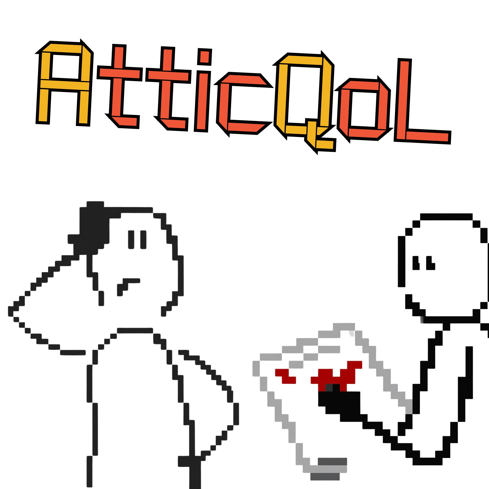
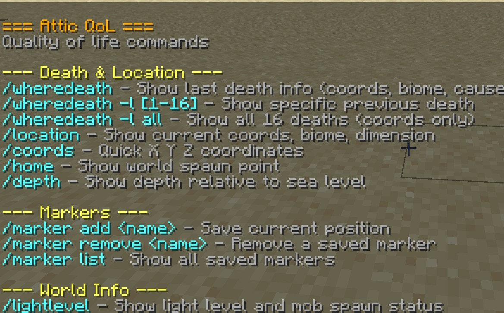
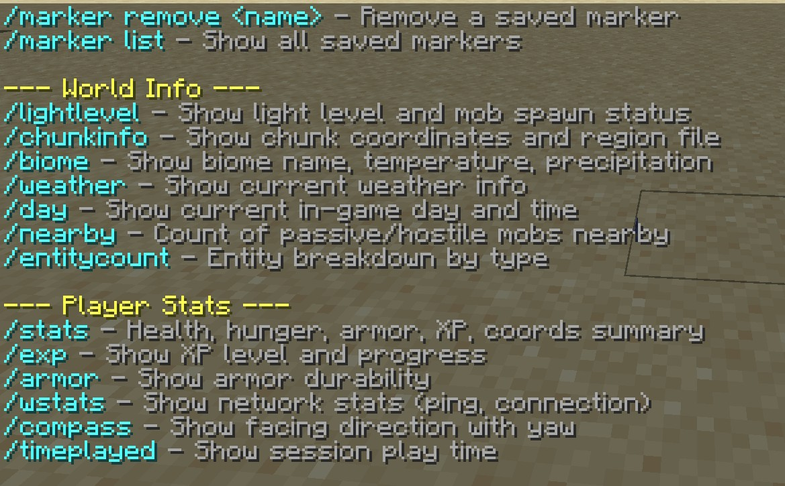
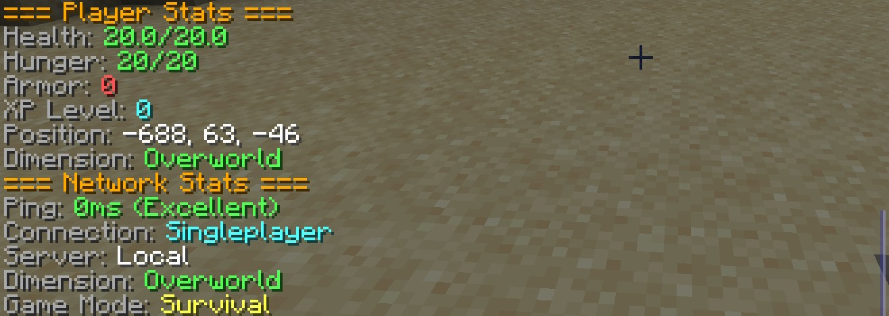
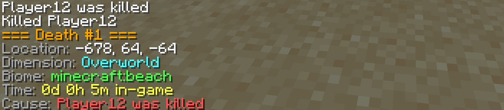

<p align="center">
  
</p>

<h1 align="center">Attic QoL</h1>

<p align="center">
  A Quality of Life mod for Minecraft 1.21.11 (Fabric)<br>
  20 commands. No cheats. Server-safe. Zero bloat.
</p>

---

## Installation

1. Install [Fabric Loader](https://fabricmc.net/use/installer/) (0.16.0+)
2. Download `atticqol-1.0.0.jar` from the `compiledmod/` folder or [Releases](https://github.com/AntacidDT/AtticQoL/releases)
3. Place the JAR in your `.minecraft/mods/` folder (or server `mods/` folder)
4. Launch Minecraft with the Fabric profile

**Dependencies:** [Fabric API](https://modrinth.com/mod/fabric-api)

## Screenshots

<p align="center">
  
  
  
  <br>
  
  
  
</p>

## Commands

### Death & Location
| Command | Description |
|---------|-------------|
| `/wheredeath` | Show last death info (coords, biome, dimension, time, cause) |
| `/wheredeath -l [1-16]` | Show a specific previous death |
| `/wheredeath -l all` | Show all 16 deaths (coords only) |
| `/location` | Show current coords, biome, dimension |
| `/coords` | Quick X Y Z coordinates |
| `/home` | Show world spawn point |
| `/depth` | Show depth relative to sea level and zone |

### Markers
| Command | Description |
|---------|-------------|
| `/marker add <name>` | Save your current position |
| `/marker remove <name>` | Remove a saved marker |
| `/marker list` | Show all saved markers with coords |

### World Info
| Command | Description |
|---------|-------------|
| `/lightlevel` | Show light level and mob spawn status |
| `/chunkinfo` | Show chunk coordinates and region file |
| `/biome` | Show biome name, temperature, precipitation |
| `/weather` | Show current weather and day/night |
| `/day` | Show current in-game day and time |
| `/nearby` | Count passive/hostile mobs in 128 block radius |
| `/entitycount` | Entity breakdown by type (top 15) |

### Player Stats
| Command | Description |
|---------|-------------|
| `/stats` | Summary: health, hunger, armor, XP, position, dimension |
| `/exp` | Show XP level, total, progress, XP to next level |
| `/armor` | Show armor durability with color warnings |
| `/wstats` | Show network stats (ping, connection type, server) |
| `/ping` | Alias for `/wstats` |
| `/compass` | Show facing direction with exact yaw degrees |
| `/timeplayed` | Show session play time |

### Help
| Command | Description |
|---------|-------------|
| `/atticqol` | Show all commands organized by category |

## Why AtticQoL?

Most QoL mods do one thing. AtticQoL does it all:

- **Death tracking** with full history (last 16 deaths)
- **Markers** for saving and sharing locations
- **World info** without opening F3
- **Player stats** at a glance
- **Network stats** for multiplayer

One mod. 20 commands. No config files. No dependencies beyond Fabric API.

## Server-Friendly

- No teleportation
- No flight or speed
- No x-ray or ESP
- No item spawning
- No game mode switching

All commands are informational only. Safe for any server.

## Building from Source

```bash
git clone https://github.com/AntacidDT/AtticQoL.git
cd AtticQoL
./gradlew build
```

Output: `build/libs/atticqol-1.0.0.jar`

## License

Apache 2.0
